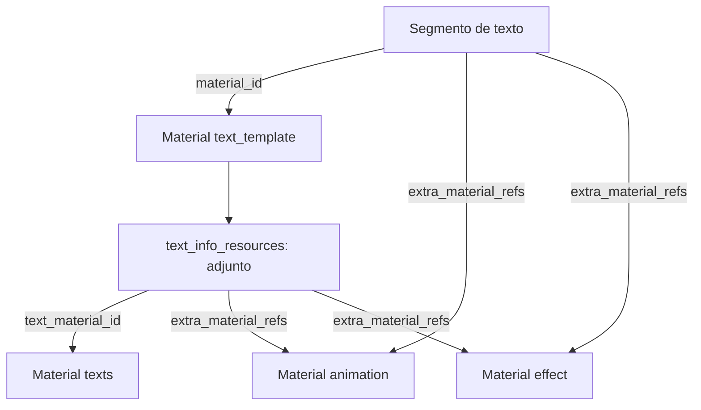

# CaptionForge — Blueprint de producto e implementación

**Versión:** 1.0 · **Fecha:** 3 de octubre de 2026 · **Autor del proyecto:** Yordin Isaac Garcia  
**Plataforma:** Windows · C# / .NET 10 · WPF  
**Estado:** decisiones del MVP y análisis de referencias consolidados; implementación pendiente.

Este documento sirve como especificación y como contexto de continuidad. Se acompaña de un paquete con los archivos originales analizados, un molde completo de subtítulo v3, los resultados esperados y una herramienta de comprobación. Para retomar el proyecto se debe leer este documento y usar esas referencias; no es necesario recuperar el chat anterior ni reconstruir las pruebas históricas.

La aplicación aún no está implementada. La v3 fue validada visualmente por el usuario en CapCut. La comprobación estructural y temporal descrita aquí trabaja con los archivos entregados; no equivale a haber ejecutado Whisper.net, FFmpeg o una nueva versión de CaptionForge en Windows.

## 1. Objetivo y límites

CaptionForge genera subtítulos automáticos locales a partir del audio utilizado en una timeline de CapCut y los incorpora a su JSON real con el estilo animado por palabras de la referencia v3. Permite identificar el proyecto, escoger la timeline, escuchar y seleccionar sus fragmentos, transcribir y aplicar los resultados con respaldo recuperable.

El problema que originó el proyecto: la plantilla deseada se aplicaba como un subtítulo independiente y no directamente al SRT importado. Después de varias pruebas, una versión generada del JSON, llamada v3, reprodujo el resultado esperado. CaptionForge debe trasladar ese comportamiento a los proyectos reales manteniendo su identidad y sus datos.

El nombre es **CaptionForge**. Se eligió independiente de Wondecode para permitir una futura distribución como freeware o software abierto. No hay decisión definitiva de licencia o distribución comercial.

### 1.1 Requisitos acordados

| Área | Requisito |
|---|---|
| Proyecto | Descubrir proyectos válidos de CapCut y permitir cambiar la carpeta de búsqueda. |
| Timeline | Listar las timelines de cada proyecto con nombre y portada; el usuario escoge una. |
| Audio | Listar pistas y fragmentos, reproducirlos e incluirlos o excluirlos de la transcripción. |
| Recortes | Respetar los rangos de origen y destino y los huecos del montaje. |
| Vídeo | Extraer su audio con FFmpeg para transcribirlo con el mismo flujo. |
| Motor | Usar Whisper.net directamente desde C#, con DTW. |
| CPU | Detectar procesadores lógicos, recomendar el 75 % y permitir cambiar y recordar la cantidad de hilos. |
| Resultado | Construir subtítulos según el molde v3, con sincronización por palabras. |
| Integridad | Modificar el JSON real conservando IDs y datos existentes; IDs nuevos para objetos nuevos. |
| Recuperación | Backups propios del estado anterior, restauración y actualización coherente de los `.bak` correspondientes. |
| Archivos propios | Carpeta por ID de proyecto y subcarpeta por ejecución, fuera del directorio interno de CapCut. |
| Interfaz | WPF, una ventana con navegación por pasos, aspecto profesional desde el MVP. |
| Adaptación | Tamaño mínimo útil; maximizar, restaurar y redimensionar distribuyen correctamente el espacio. |
| Formatos | Tratar portadas verticales, horizontales y cuadradas sin deformarlas ni recortarlas. |

### 1.2 Fuera del alcance inicial

Edición o corte de audio, creación de timelines, editor completo de vídeo, procesamiento en servidores externos, cuentas de usuario, integración con nubes y biblioteca arbitraria de plantillas. El SRT es una exportación complementaria: importar un SRT no es un paso obligatorio para generar subtítulos.

No introducir capas de plugins, buses de mensajes, microservicios, bases de datos de servidor ni generalización a otros editores. El MVP es una aplicación de escritorio que trabaja con archivos locales.

### 1.3 Convenciones de certeza

- **Acordado:** decisión expresada y aceptada en la conversación.
- **Comprobado:** observado directamente en los archivos o en su comparación.
- **Propuesta de implementación:** elección concreta que facilita desarrollar lo acordado; no es una función nueva aprobada por el usuario.
- **Pendiente de verificar:** requiere una prueba de ejecución o un ejemplo adicional. Se puede avanzar con el caso conocido sin fingir compatibilidad universal.

## 2. Estado de la solución C#

La solución fue creada correctamente en `C:\Proyectos\CaptionForge`. Actualmente tiene bibliotecas de clases y pruebas; WPF todavía no está añadido.

| Proyecto | Ruta relativa | Framework | Referencias actuales |
|---|---|---|---|
| CaptionForge.Core | `src/CaptionForge.Core` | `net10.0` | Ninguna. |
| CaptionForge.Application | `src/CaptionForge.Application` | `net10.0` | Core. |
| CaptionForge.Infrastructure | `src/CaptionForge.Infrastructure` | `net10.0` | Core y Application. |
| CaptionForge.Tests | `tests/CaptionForge.Tests` | `net10.0` | Core, Application e Infrastructure; xUnit. |

**Responsabilidades propuestas:** Core contiene datos y reglas temporales; Application coordina los casos de uso; Infrastructure accede a CapCut, archivos, FFmpeg y Whisper.net. El futuro proyecto WPF contendrá vistas y ViewModels. Las dependencias externas y el JSON completo de CapCut no deben invadir los ViewModels ni obligar a modelar cada propiedad desconocida del editor.

Para el JSON se propone `System.Text.Json` y una representación editable como `JsonNode`, con extracción tipada de los pocos campos necesarios. Evitar deserializar todo el proyecto a clases incompletas y volverlo a serializar perdiendo campos.

Usar MVVM en WPF. Un contenedor de dependencias sencillo en el punto de arranque será suficiente. Estos son criterios de implementación; aún no se ha seleccionado un paquete visual ni una biblioteca MVVM específica.

## 3. Herramientas y dependencias

### 3.1 Whisper.net

La decisión final es usar **Whisper.net**, un enlace .NET con whisper.cpp como motor nativo. La aplicación recibe resultados en memoria, en lugar de obtener la transcripción leyendo la salida del CLI. El adaptador de Infrastructure los convierte a tipos propios de CaptionForge.

La primera propuesta de invocar `whisper-cli.exe` fue sustituida por esta decisión. El comando histórico se conserva exclusivamente como referencia de reproducción y comparación.

Paquetes previstos para CPU: `Whisper.net` y `Whisper.net.Runtime`. Las versiones deben fijarse después de comprobar la API y el runtime escogidos. No instalar todos los runtimes por defecto ni introducir GPU en el primer bloque de trabajo.

La documentación consultada expone configuración DTW en `WhisperFactoryOptions`, con `UseDtwTimeStamps` y `HeadsPreset`. El builder expone `WithThreads`, `WithLanguage` y `WithTokenTimestamps`. DTW y timestamps de token son opciones relacionadas pero no intercambiables. Hay que comprobar la correspondencia de los datos del wrapper con los `offsets` de los fixtures; no asumir equivalencia por compartir motor.

El runtime, su compatibilidad con el Windows objetivo y los requisitos nativos deben verificarse al fijar la versión. La referencia de CapCut informa app 9.5.0; no se establece compatibilidad automática con cualquier versión pasada o futura.

### 3.2 FFmpeg

FFmpeg prepara audio de vídeos y audios: selecciona el tramo de origen, decodifica y produce WAV PCM mono de 16 kHz. El WAV se guarda como artefacto de la ejecución y se entrega a Whisper.net.

Para el MVP se propone invocar el ejecutable FFmpeg mediante un servicio encapsulado. La decisión de usar una biblioteca directa para Whisper no obliga a usar enlaces nativos de FFmpeg: son integraciones independientes. Utilizar `ProcessStartInfo.ArgumentList`, capturar errores y comprobar el código de salida. Evitar construir comandos con rutas concatenadas o abrir una consola para el usuario.

La reproducción del audio en WPF requiere elegir una implementación concreta más adelante. No se ha acordado NAudio, MediaElement ni LibVLCSharp para CaptionForge. Se puede reproducir el audio preparado para garantizar que la escucha corresponda al recorte que será transcrito.

### 3.3 Modelos e idiomas

El modelo de referencia es **`ggml-medium.en.bin`**, con idioma `en`, sin traducción. Es una referencia inglesa, no un modelo multilingüe. No afirmar que esa configuración admite español.

CaptionForge no se limita conceptualmente a Reels ni a inglés. La selección de modelos, los idiomas ofrecidos, el modo de descarga y los valores iniciales de esos controles no quedaron cerrados. Mantenerlos como decisión pendiente de producto y compatibilidad. Para el primer ensayo de equivalencia usar exactamente la referencia inglesa conocida.

## 4. Estructura real del proyecto CapCut

Ruta candidata habitual de descubrimiento:

`%LOCALAPPDATA%\CapCut\User Data\Projects\com.lveditor.draft`

Proyecto analizado:

`C:\Users\yordi\AppData\Local\CapCut\User Data\Projects\com.lveditor.draft\1003`

La ruta habitual es una candidata, no una garantía universal. Enumerar y validar proyectos; si no se encuentran, ofrecer seleccionar una ubicación y recordar la elección.

### 4.1 Archivos y ubicaciones observados

| Ubicación relativa | Función / tratamiento |
|---|---|
| `draft_meta_info.json` | Identidad, nombre, portada, fechas, material importado y rutas. |
| `draft_content.json` | Contenido del montaje reflejado en la raíz del proyecto analizado. |
| `draft_content.json.bak` | Copia nativa de CapCut; el usuario observó restauraciones desde un `.bak` antiguo. |
| `draft_cover.jpg` | Portada del proyecto; el archivo de imagen no se entregó como referencia. |
| `timeline_layout.json` | Timelines acopladas en la interfaz y sus nombres; no usar como inventario único. |
| `Timelines/project.json` | Registro de timelines, `main_timeline_id` y configuración. |
| `Timelines/project.json.bak` | Copia nativa del registro; no debe modificarse si no cambia el registro. |
| `Timelines/{timelineId}/draft_content.json` | Documento de la timeline que se selecciona. |
| `Timelines/{timelineId}/draft_content.json.bak` | Copia nativa correspondiente a esa timeline. |
| `Timelines/{timelineId}/draft_cover.jpg` | Portada prevista de la timeline, observada en el árbol. |
| `attachment_editing.json`, `attachment_pc_common.json` | Datos auxiliares de CapCut. Preservar salvo necesidad demostrada. |
| `draft_agency_config.json`, `draft_biz_config.json` | Configuración auxiliar. El segundo apareció en el árbol, pero no fue entregado. |
| `draft_settings`, `draft_virtual_store.json`, `key_value.json`, `performance_opt_info.json` | Estado auxiliar, organización y referencias. No modificar por rutina. |
| `template.tmp`, `template-2.tmp` | Archivos auxiliares observados. Su papel de persistencia no fue verificado. |
| `common_attachment`, `attachment/patch` | Adjuntos auxiliares, incluidos `mini_draft.json` y `patch.json` en la timeline. |
| `Resources/audioAlg`, `Resources/videoAlg`, `digitalHuman`, `matting`, `smart_crop`, `subdraft` | Recursos y estructuras auxiliares; no equivalen al archivo de audio de la pista. |

La raíz y la timeline coinciden en el proyecto entregado, según comprobación del usuario. Es una propiedad de esta muestra. No asumir que todas las timelines de un proyecto deben contener el mismo JSON, ni copiar la timeline seleccionada sobre la raíz sin identificar qué documento está reflejando esa raíz.

## 5. Identificación: tres IDs distintos

| Identidad | Fuente | Valor real del ejemplo |
|---|---|---|
| Proyecto de CapCut | `draft_meta_info.json.draft_id` | `2A30AAE9-2228-48ab-BA00-AF0598C88C3B` |
| Registro de timelines | `Timelines/project.json.id` | `3A81E819-70C3-4b5c-8DB8-4D07897271C9` |
| Timeline | `timelines[].id`, `main_timeline_id`, carpeta y `draft_content.id` | `EFA8ACC8-F181-4059-96C5-6BC82353A0C6` |

**La carpeta propia de CaptionForge utiliza el ID del proyecto, no el ID del registro ni el de la timeline.** Cada ejecución registra el ID de la timeline seleccionada.

El proyecto se llama `1003`. Su portada indicada en metadatos es `draft_cover.jpg`. La timeline se llama `Línea de tiempo 01`.

Registro reducido del ejemplo:

```json
{
  "id": "3A81E819-70C3-4b5c-8DB8-4D07897271C9",
  "main_timeline_id": "EFA8ACC8-F181-4059-96C5-6BC82353A0C6",
  "timelines": [
    {
      "id": "EFA8ACC8-F181-4059-96C5-6BC82353A0C6",
      "name": "Línea de tiempo 01",
      "is_marked_delete": false
    }
  ],
  "version": 0
}
```

El archivo completo también contiene configuración y fechas, preservadas en el paquete. `main_timeline_id` señala la principal; no se ha demostrado que sea siempre la pestaña activa más reciente. La selección del usuario es la que define el trabajo de CaptionForge.

Lectura propuesta:

1. Leer metadatos y validar el proyecto.
2. Leer `Timelines/project.json` y listar las entradas utilizables, descartando las marcadas para eliminación.
3. Comprobar la carpeta y el documento de cada entrada.
4. Resolver su portada relativa a su ubicación; usar imagen predeterminada si falta.
5. Al seleccionar, volver a comprobar su identidad y capturar el estado que se procesará.

La pantalla de selección de timeline sigue formando parte del flujo acordado incluso cuando el proyecto tiene una sola. No cambiar automáticamente `main_timeline_id` por generar subtítulos en otra timeline.

## 6. Descubrimiento del audio y de los fragmentos

Una pista no es un archivo físico en la carpeta del proyecto. `tracks` contiene pistas; `segments` contiene sus fragmentos. Cada segmento apunta por `material_id` a un material del documento.

Para audio: buscar en `materials.audios`. Para audio contenido en vídeo: resolver el material correspondiente en `materials.videos` y comprobar que su archivo tiene audio. El caso de vídeo aún no está verificado con un fixture propio. Para clips compuestos o subdrafts tampoco existe todavía una política validada de navegación y extracción; no tratarlos como archivos simples.

### 6.1 Referencias reales del audio analizado

| Elemento | Valor |
|---|---|
| Pista de audio | `D66CD590-F6B6-47f5-BB5A-7C7D76F8B3AA` |
| Segmento | `AD298FE0-856F-4cef-BD60-839FC84C820B` |
| Material de audio | `46EA7246-9A61-4611-951E-B2E93F0715ED` |
| Identidad local de importación | `a8f05921-4a02-48eb-956e-d0a84c90500c` |
| Tipo del material | `extract_music` |
| Velocidad del segmento | `1.0` |
| `source_timerange` | inicio `0`, duración `36533333` µs |
| `target_timerange` | inicio `0`, duración `36533333` µs |

Archivo original:

```text
C:\Users\yordi\OneDrive\Monetizacion Tiktok\Video 1\ElevenLabs_2026-10-01T03_49_02_Nichalia Schwartz - Bright and Friendly_pvc_sp100_s50_sb100_v4.mp3
```

La ruta está en `materials.audios[].path`. Los metadatos de importación también la contienen como `draft_materials[].value[].file_Path`, con esa capitalización. La lista de importación no basta para determinar qué se usa realmente: la selección se obtiene de los segmentos de la timeline.

El audio no apareció en el árbol de carpetas porque vive fuera del proyecto. Si se añade otro audio diferente, sus segmentos apuntarán a su material y ruta. Si se recorta el mismo audio varias veces, los segmentos pueden compartir el material y variar sus rangos.

Si un archivo falta, permitir localizarlo para esta ejecución. La decisión no autoriza por sí sola a reescribir las rutas de medios del proyecto CapCut: cualquier reparación permanente requiere un flujo explícito.

### 6.2 Pistas y chunks

En este documento **fragmento o chunk** significa segmento existente de la timeline, no una división adicional arbitraria del audio. No confundir un segmento de CapCut con un segmento de transcripción de Whisper: un fragmento puede producir varias frases/subtítulos.

El usuario puede escuchar una pista y sus fragmentos, y marcar cuáles se procesan. Excluir conserva el contenido original de CapCut. La acción visible se llama «Excluir de la transcripción» o se representa mediante una casilla de inclusión.

Para el MVP se propone procesar los fragmentos secuencialmente, con un único motor de transcripción trabajando cada vez. Evita multiplicar el uso de CPU y memoria por varios procesos concurrentes.

## 7. Preparación y correspondencia temporal

### 7.1 Unidades

| Dato | Unidad / significado |
|---|---|
| `source_timerange.start/duration` | Microsegundos dentro del medio original. |
| `target_timerange.start/duration` | Microsegundos dentro de la timeline. |
| Rango del segmento de texto | Microsegundos dentro de la timeline. |
| `texts.words.start_time/end_time` | Milisegundos relativos al inicio del subtítulo. |
| `offsets.from/to` de los fixtures Whisper | Milisegundos relativos al audio transcrito. |
| `t_dtw` de los fixtures | Dato de alineación distinto de esos offsets; no usarlo como milisegundos sin adaptación. |

Usar enteros de 64 bits para los tiempos del dominio y conversiones explícitas. Un `TimeSpan` usa ticks de 100 ns, no microsegundos; dividir o multiplicar con la unidad declarada al adaptar la API. Mantener un solo criterio de redondeo y comprobarlo con los fixtures.

### 7.2 Procedimiento por fragmento

1. Resolver el medio y los rangos desde el JSON real.
2. Extraer exactamente el intervalo de origen que indica `source_timerange`.
3. Preparar el audio que corresponda al fragmento tal como se oye en el montaje, incluyendo la velocidad cuando esté soportada.
4. Guardar un WAV PCM mono de 16 kHz.
5. Transcribirlo con Whisper.net; los tiempos reconocidos quedan referidos al WAV preparado.
6. Trasladar esos tiempos al origen temporal del fragmento en la timeline.
7. Formar los subtítulos y ajustar sus límites al rango de destino sin invadir otros fragmentos.

Fórmula después de preparar el audio a la velocidad del montaje:

```text
inicio_global_us = target_start_us + inicio_local_us
fin_global_us    = target_start_us + fin_local_us
```

Ejemplo: origen 10–15 s, destino 20–25 s, palabra reconocida en 1,2–1,6 s del WAV; se sitúa en 21,2–21,6 s del montaje.

**Excluir el tramo 10–15 s del montaje no adelanta los subtítulos posteriores.** Cada fragmento conserva su inicio de destino. No concatenar audios eliminando huecos y luego aplicar los tiempos concatenados directamente al montaje.

### 7.3 Velocidad y casos especiales

Para el caso validado, velocidad 1.0, el tiempo local coincide con el recorte de origen. Con velocidad constante distinta de 1.0, la preparación debe producir audio con la duración de destino. Una alternativa sería transformar matemáticamente tiempos reconocidos sobre audio sin retimar; no mezclar ambos procedimientos ni dividir por la velocidad otra vez si el WAV ya fue retimado.

Las curvas de velocidad requieren una correspondencia variable y no se resuelven con una división constante. El soporte de velocidad constante, curvas, reversa, silencios y audio de clips compuestos está pendiente de pruebas. Propuesta de seguridad para la primera implementación: detectar los casos no soportados y explicar la limitación antes de generar o guardar.

Las pistas simultáneas pueden contener música, voces duplicadas o mezclas. La selección por pistas/fragmentos está acordada; la estrategia de mezcla y los solapamientos entre distintas voces no quedó definida. Evitar atribuir al MVP separación de voces, diarización o mezcla automática inteligente.

### 7.4 Precisión y duración real

La muestra de importación registra duración `36525000` µs, mientras la timeline utiliza `36533333` µs. La diferencia es aproximadamente 8,33 ms. Los rangos de la timeline definen la ubicación deseada; el archivo real debe inspeccionarse para decidir cómo tratar el pequeño final fuera del audio, por ejemplo mediante relleno de silencio. No usar la duración del catálogo de medios para reemplazar a ciegas la duración del montaje.

La precisión de los recortes requiere decodificación adecuada y verificación de la duración del WAV; no basta con copiar paquetes de un contenedor comprimido. FFmpeg debe validar que existe una pista de audio y producir el formato esperado. Un vídeo sin audio se mostrará como no transcribible.

## 8. Configuración de CPU y persistencia

Detectar procesadores lógicos disponibles, no confundirlos con núcleos físicos. Propuesta en .NET: `Environment.ProcessorCount`, con comprobación de los límites disponibles en el entorno objetivo.

```text
recomendados = max(1, floor(procesadores_logicos × 0.75))
seleccionados ∈ [1, procesadores_logicos]
```

Ejemplos: 8 → 6, 12 → 9, 16 → 12. Etiqueta «Hilos para transcripción», valor recomendado visible y elección recordada. Si una preferencia guardada supera la capacidad del equipo actual, ajustarla al rango válido y mostrar el valor efectivo.

El 75 % es una sugerencia de hilos, no un límite garantizado de consumo de CPU. Más hilos no aseguran mayor velocidad. El ajuste corresponde a Whisper; no se acordó hacer coincidir automáticamente los hilos de FFmpeg con ese valor.

Guardar como mínimo la ruta de búsqueda de CapCut, la ubicación propia de CaptionForge y los hilos seleccionados. Ruta inicial de almacenamiento, modelo, idioma y otras preferencias tienen valores concretos pendientes. Se propone un archivo local `settings.json`; no hace falta una base de datos para estas opciones.

## 9. Whisper: referencia histórica y contrato de adaptación

Comando usado como referencia histórica:

```powershell
.\whisper-cli.exe -m ".\models\ggml-medium.en.bin" -f ".\test.mp3" -l en -t 6 -ng -dtw medium.en -ojf -of ".\output\test_words"
```

Esto documenta modelo, inglés, seis hilos, GPU desactivada, DTW `medium.en` y JSON completo. No es el mecanismo escogido para CaptionForge. La versión exacta del ejecutable y el hash del modelo no constan en los archivos entregados; deben registrarse cuando se ejecute la comparación real.

Ambos fixtures tienen 15 segmentos de transcripción y texto equivalente. El normal tiene `t_dtw = -1`; el DTW incluye valores no negativos para tokens léxicos. Los offsets de algunos tokens cambian.

La adaptación de Whisper.net debe producir un resultado propio que incluya como mínimo:

- Identificador del fragmento de origen y WAV preparado.
- Modelo, idioma, runtime y configuración efectivos.
- Segmentos de texto con inicio y final relativos al WAV.
- Tokens con texto y comienzo/final normalizados a una unidad declarada.
- Datos adicionales de alineación, si están disponibles, sin mezclarlos con offsets.

No usar únicamente el texto final de una frase: el efecto por palabras necesita tiempos internos. Tampoco usar cada token como una palabra: los tokens pueden ser partes de palabras, puntuación o símbolos de control.

Hay que comprobar unidades, opciones por defecto de decodificación y correspondencia de timestamps en la versión elegida de Whisper.net. Las APIs consultadas sustentan la viabilidad, pero no se ha compilado ni ejecutado un adaptador .NET todavía. No activar VAD, cambios de segmentación o parámetros nuevos durante el ensayo inicial de equivalencia.

## 10. Referencia definitiva v3

**Archivo:** `references/golden_v3.json`, copia íntegra de `draft_content(8).json`. En el historial corresponde al resultado final v3 con tiempos corregidos, aceptado por el usuario en CapCut.

No se recuperó el script original que produjo esa versión: se generó mediante pruebas internas en otro chat. El historial incluido describe los ensayos, pero no contiene un generador completo reutilizable. Se reconstruyeron reglas que coinciden con la muestra; hay que portarlas y validarlas, no afirmar que se dispone del programa original.

### 10.1 Características comprobadas

| Dato | Valor |
|---|---|
| ID del documento golden | `24E53CD0-77A5-46ac-ABD7-5654A7C74189` — referencia ajena al proyecto actual. |
| Versión interna | `version = 360000`, `new_version = 187.0.0`. |
| Plataforma de referencia | CapCut Windows, app `9.5.0`. |
| Canvas de la muestra | 1080 × 1920, proporción 9:16. |
| FPS | 30. |
| Duración del documento | `36533333` µs. |
| Subtítulos | 15 segmentos y 91 palabras léxicas. |
| Materiales de texto | 15 textos, 15 templates, 15 efectos y 15 animaciones. |
| Material de audio | Uno, más sus dependencias auxiliares. |
| Transformación de subtítulos | Escala x/y 1.0, posición y `-0.56`. |
| Texto | Tamaño 17, color `#00e5ffff`, `line_max_width = 0.82`. |
| Procedencia del texto | `type = text`, `add_type = 0`, sin tarea de reconocimiento de CapCut. |
| Grupo observado | `caption_template_1790995564237`. |

Conservar estos valores en el molde de referencia; el canvas, FPS, IDs, audio y configuración global del proyecto destino deben proceder del destino. La compatibilidad visual en horizontal/cuadrado requiere prueba: no convertir todos los proyectos a 9:16 para que coincidan con esta muestra.

### 10.2 Recursos exactos

| Recurso | ID de recurso golden |
|---|---|
| Plantilla / efecto de plantilla | `7535399757947161873` |
| Nombre interno | `逐词显色2-短文本` |
| Fuente Bebas Neue | `7517426090072149264` |
| Archivo de fuente | `BebasNeue-Regular.ttf` |
| Animación caption | `7289356246623195649` |
| Efecto de texto | `7340940260152447489` |

Rutas observadas, relativas a `%LOCALAPPDATA%\CapCut\User Data\Cache\effect`:

| Recurso | Sufijo observado |
|---|---|
| Plantilla | `7535399757947161873/ae92e3cb3480090dfea046d1283495cf` |
| Fuente | `7517426090072149264/ee0084abe34f3bca75c44ce2ee61c4e5/BebasNeue-Regular.ttf` |
| Efecto | `239386920/b7bae96650ebe1f0fbdf8825910dd311` |
| Animación | `110456508/d62a12a386bf578a8eb03187095d7c7d` |

No todas las carpetas de caché se llaman igual que el `resource_id`. Resolver y comprobar los recursos existentes; no suponer que `effect/{resourceId}` es siempre suficiente ni conservar el usuario `yordi` como ruta universal. El paquete contiene referencias a recursos, no las fuentes ni los binarios de esos recursos.

Si faltan, explicar qué recurso necesita estar instalado en CapCut. La adquisición, redistribución y descarga automática de plantillas/fuentes no están resueltas en el MVP. No sustituir la fuente o la plantilla silenciosamente.

## 11. Comparación de las tres etapas nativas

Los tres snapshots comparten el ID de timeline `EFA8ACC8-F181-4059-96C5-6BC82353A0C6`, el audio y las pistas existentes. Son estados del proyecto de prueba, no documentos que deban copiarse completos sobre otros proyectos.

| Etapa | Contenido / diferencia principal |
|---|---|
| Solo audio | Pista de vídeo vacía y una pista de audio con un segmento. |
| Con SRT | Añade una pista de texto con 15 segmentos, 15 materiales `subtitle` y 15 animaciones vacías. |
| Con plantilla manual | Conserva el SRT y añade otra pista con un subtítulo de muestra, un template, un efecto y una animación caption. |

IDs de pistas del proyecto de prueba:

| Pista | ID |
|---|---|
| Vídeo | `74786E62-3725-41dd-B84D-A83BFE8CB4AB` |
| Audio | `D66CD590-F6B6-47f5-BB5A-7C7D76F8B3AA` |
| SRT | `64ABF39F-1724-4083-BB35-D72520AF10FD` |
| Plantilla manual | `21CE03F5-6613-4303-81AB-4BE319E42070` |

Cambios incidentales observados: el canvas pasó de horizontal a vertical, los textos SRT cambiaron tamaño y transformación, y se normalizaron algunas propiedades. No son dependencias estructurales demostradas de la plantilla. El índice de render de la pista de audio pasó de 1 a 2 y después a 3 al añadirse pistas.

Todos los rangos de los 15 subtítulos importados del SRT coinciden con los rangos golden. Sus materiales directos tienen `type = subtitle`, `add_type = 2`, grupo de importación y arrays `words` vacíos; su estructura no es aún la del efecto animado golden.

### 11.1 Advertencia crítica sobre la plantilla manual reciente

El snapshot manual y la copia de raíz reciente usan **otro recurso**, aunque el nombre interno es el mismo:

| Recurso | Golden v3 definitivo | Plantilla manual reciente |
|---|---|---|
| Plantilla | `7535399757947161873` | `7535398994294476049` |
| Fuente | `7517426090072149264` | `7506401698856865040` |

La fuente manual usa `font.ttf`. La plantilla manual demuestra el grafo nativo, pero **no sustituye al molde v3**. El usuario corrigió expresamente una propuesta que usaba esa variante reciente. Este documento adopta la corrección.

`root_draft_content.json` contiene el estado con SRT y plantilla manual. Su única diferencia respecto al snapshot manual entregado es una representación numérica mínima de `original_size_height`: `99.87499237060547` frente a `99.87499237060548`. No es un nuevo golden.

## 12. Grafo de materiales del subtítulo v3

Cada subtítulo conecta un segmento, un template, un recurso de texto adjunto, un material de texto, una animación y un efecto.



**Órdenes observados que deben conservarse:**

- Segmento: `extra_material_refs = [animationId, effectId]`.
- Adjunto: `extra_material_refs = [effectId, animationId]`.
- Template: `text_info_resources[0].text_material_id = textId`.
- Segmento: `material_id = templateId`.

Todos los IDs deben referirse a objetos existentes en el documento resultante. En pruebas anteriores, referencias inconsistentes contribuyeron a un comportamiento incorrecto: la frase se superponía o quedaba toda coloreada durante la animación. No basta con rellenar `words` si el grafo está roto.

### 12.1 Ejemplo real del primer subtítulo golden

| Objeto | ID de referencia |
|---|---|
| Segmento | `655E7493-0382-4E94-89D0-4A3DAB0A61F8` |
| Template | `C819059A-2DA5-4933-8B98-C1C28D3952C3` |
| Adjunto | `9A21974F-BB01-4703-923B-FFFB96FE7611` |
| Texto | `1360C9D2-B184-4E86-B370-879A0A219C63` |
| Animación | `66E10CFB-2B8D-4C33-9565-99181D602B5B` |
| Efecto | `10A09847-6C15-4718-A13C-FB92856B7E94` |

Estos IDs describen el fixture; no se copian como identidades nuevas a todos los proyectos. Los IDs de recurso externos sí identifican el estilo elegido. El paquete incluye `caption_mold_v3.json` con los objetos completos, incluidas sus propiedades auxiliares.

### 12.2 Duraciones y propiedades

En los 15 subtítulos golden:

```text
segment.target_timerange.duration = D
attachment.attach_info.start_time = 0
attachment.attach_info.duration = D - 1 microsegundo
animation.animations[0].start = 0
animation.animations[0].duration = D - 1 microsegundo
```

La animación tiene material `type = sticker_animation` y animación interna `type = caption`. El efecto es `type = text_effect`. El template es `type = text_template_subtitle` y `text_template_resource_type = subtitle_template`.

Los adjuntos golden comparten `original_size_width = 1084.8125` y `original_size_height = 99.16666412353516`. Son valores de la muestra vertical: su uso en otros tamaños requiere verificar el resultado, no convertirlos en una fórmula universal sin prueba.

Algunos identificadores auxiliares embebidos, como el ID en `texts.fonts`, se repiten en golden. No aplicar una sustitución recursiva indiscriminada de toda cadena con formato GUID. Distinguir identidades de objetos, referencias internas y metadatos de recursos.

## 13. Texto anidado y arrays de palabras

`materials.texts[].content` es una **cadena que contiene JSON**, no un objeto del documento exterior. Se debe parsear por separado, modificar el texto y el rango de estilo y volver a serializar como cadena válida.

Primer contenido golden reducido:

```json
{
  "text": "This QR code is damaged.",
  "styles": [
    {
      "font": {"id": "7517426090072149264", "path": "ruta válida a BebasNeue-Regular.ttf"},
      "size": 17,
      "range": [0, 24]
    }
  ]
}
```

Este ejemplo omite propiedades por legibilidad; usar el molde completo del paquete para clonar estilo, fill y effectStyle. `[0,24]` corresponde a toda la frase sin el espacio inicial del texto Whisper. Para caracteres fuera del plano básico, validar la convención de índices de CapCut; no asumir que contar bytes UTF-8 o puntos Unicode produce el mismo rango que UTF-16 de C#.

Los tres arrays de `words` son paralelos, con tiempos en milisegundos relativos al subtítulo. Incluyen entradas explícitas de espacio. En golden, cada espacio tiene duración cero y usa el final de la palabra anterior; el inicio real de la siguiente palabra mantiene una posible pausa.

```json
{
  "start_time": [0, 510, 520, 760, 760, 1270, 1270, 1520, 1520],
  "end_time": [510, 510, 760, 760, 1270, 1270, 1520, 1520, 2433],
  "text": ["This", " ", "QR", " ", "code", " ", "is", " ", "damaged."]
}
```

Primer segmento: inicio `0`, duración `2433333` µs. Adjunto y animación: `2433332` µs. El límite de las palabras se expresa como `2433` ms. `current_words` tiene arrays vacíos en golden.

Validaciones mínimas: arrays de igual longitud, concatenación igual al texto, límites no negativos dentro de la duración redondeada, palabras léxicas con duración positiva y espacios con duración cero en el modo de referencia. Conservar las pausas; no repartir una frase uniformemente por palabras.

## 14. Reconstrucción comprobada de los tiempos v3

Esta sección documenta una reconstrucción que reproduce el fixture, no una garantía de que toda transcripción futura tendrá los mismos límites.

### 14.1 Segmentación y conversión a fotogramas

Cada uno de los 15 segmentos de Whisper se convirtió en un subtítulo. Para la muestra a 30 FPS:

```text
start_frame = floor(from_ms × 30 / 1000)
duration_frames = floor((to_ms - from_ms) × 30 / 1000)
start_us = floor(start_frame × 1000000 / 30)
end_us = floor((start_frame + duration_frames) × 1000000 / 30)
duration_us = end_us - start_us
```

Se cuantizan el inicio y la duración en fotogramas; cuantizar inicio y final de forma independiente no reproduce todos los rangos. Hay huecos de aproximadamente un fotograma entre algunos subtítulos; no rellenarlos por rutina.

Para otros FPS se debe usar el FPS real del destino, idealmente como razón exacta cuando sea fraccionario. La generalización a 24, 25, 60 o 29,97 FPS todavía debe probarse. Para fragmentos desplazados, aplicar la ubicación global y el ajuste de fotogramas sin producir subtítulos fuera de los límites; el fixture de inicio cero por sí solo no prueba ese caso.

### 14.2 Tokens a palabras

Reglas reconstruidas para esta muestra inglesa:

1. Ignorar tokens de control cuyo texto empieza por `[_`.
2. Un token que comienza con espacio inicia una palabra nueva.
3. Un token sin espacio inicial continúa la palabra previa: subpalabras, apóstrofos, guiones o porcentajes pueden requerir unión.
4. La puntuación aislada `.,!?;:` se añade a la palabra previa sin ampliar su final léxico.
5. Otras continuaciones amplían el final al offset final de su token.
6. Convertir offsets absolutos a tiempos relativos al subtítulo usando el inicio cuantizado, redondeado a milisegundos.
7. Limitar los tiempos al intervalo del subtítulo.
8. Fijar el inicio de la primera palabra en cero y el final de la última en la duración redondeada del subtítulo.
9. Insertar espacios explícitos con inicio = final = final de la palabra anterior.

Redondeo positivo reconstruido: `round_ms(us) = floor((us + 500) / 1000)`. En C# elegir la semántica correspondiente explícitamente; no depender del redondeo bancario por defecto.

Estos ajustes de extremos corresponden a cada frase reconocida, no a todo el fragmento de audio. No extender la primera palabra al comienzo de un fragmento que contiene silencio previo si su subtítulo empieza después.

### 14.3 Offsets y correcciones editoriales

El cálculo compatible usa `tokens[].offsets.from/to` del archivo **DTW**, no `t_dtw` crudo. En la primera frase, por ejemplo, los offsets DTW de «This» son 40–510 ms, mientras los normales son 40–430 ms. Después se aplica el ajuste de primer inicio a cero.

Se identificaron dos correcciones humanas exclusivas del texto de ejemplo:

- Frase 10: `code words.` se convirtió en `codewords.`, uniendo sus intervalos.
- Frase 15: `Not magic, math.` se convirtió en `Not magic. Math.`.

No convertir estas sustituciones en reglas globales del producto. El verificador de fixtures las aplica para reconstruir el resultado histórico. La edición manual de textos y sus controles todavía no se ha definido como función del front.

### 14.4 Resultado de la comprobación incluida

| Comparación | Rangos iguales | Texto igual después de correcciones del ejemplo | Arrays de palabras iguales |
|---|---:|---:|---:|
| Whisper DTW frente a golden | 15/15 | 15/15 | 15/15 |
| Whisper normal frente a golden | 15/15 | 15/15 | 13/15 |

Las diferencias de palabras en el fixture normal están en las frases 1 y 11. Los 15 grafos golden, duraciones internas y arrays pasaron la validación estructural incluida. El total es de 91 palabras léxicas.

Herramienta reproducible: ejecutar `python tools/verify_reference.py` desde una copia descomprimida del paquete, con Python 3.9 o posterior. Solo lee fixtures; no genera cambios de CapCut ni ejecuta el motor. El informe guardado está en `references/validation_report.json`.

## 15. Contrato de modificación del JSON real

### 15.1 Preservación

Siempre partir del documento real seleccionado. Preservar el ID del documento, identidad de proyecto y registro, pistas no afectadas, segmentos y materiales ajenos, rutas de medios, canvas, FPS, ajustes y propiedades desconocidas.

Clonar únicamente los objetos necesarios del molde golden. Nunca copiar su documento completo para luego cambiar unos pocos IDs. No borrar reconocimiento o configuración global existente solo porque el golden no tenga tareas de reconocimiento.

Para cada nuevo subtítulo crear identidades de segmento, template, adjunto, texto, animación y efecto según corresponda. Crear un grupo de captions propio para el conjunto y guardar las asociaciones en el registro de CaptionForge. Evitar colisiones con IDs ya existentes. Los IDs de recurso de plantilla, fuente, animación y efecto conservan su significado externo.

### 15.2 Actualización y conversión de subtítulos existentes

Si se actualiza un conjunto administrado por CaptionForge, conservar sus IDs y modificar los datos de contenido, tiempos y estilo necesarios. Identificarlo por el registro propio de la ejecución, no por la simple existencia de una pista de texto.

La conversión de SRT existente es estructuralmente posible conservando las identidades seleccionadas:

- Conservar ID de pista, segmento y texto.
- Cambiar `segment.material_id` del texto directo a un template añadido.
- Hacer que el adjunto del template apunte al ID de texto conservado.
- Completar la animación existente, cuando corresponde, conservando su ID.
- Añadir un efecto y remapear ambos arrays de referencias en el orden golden.
- Actualizar contenido anidado, rango, `words` y propiedades de texto creadas localmente.

Esto no convierte el SRT en un requisito de entrada. La decisión de qué hacer si ya existen subtítulos ajenos —conservar, sustituir un conjunto seleccionado o convertirlo— no se cerró todavía. Propuesta inicial: generar en un conjunto propio y no eliminar textos ajenos automáticamente; advertir sobre posibles duplicados visuales y concretar la elección antes de habilitar una sustitución. En el snapshot actual hay 15 SRT y un caption manual, por lo que esta decisión afecta a la primera prueba visual.

### 15.3 Pistas y orden de render

Mantener coherencia entre la posición de las pistas y sus `track_render_index`, así como el `render_index` del segmento. La muestra golden usa `render_index = 14000` para el primer caption y `track_render_index = 1`. Es un valor de referencia, no un número universal para toda inserción.

Los snapshots muestran que CapCut ajustó el índice de la pista de audio al insertar texto. El algoritmo debe considerar el orden real del destino y verificar la interpretación del editor. No trasladar índices de otro documento si generan capas incorrectas.

### 15.4 Validaciones antes de escribir

Comprobar JSON exterior e interior válidos; identidad conservada; ausencia de colisiones en las identidades de objetos; todas las referencias internas resueltas; arrays y textos coherentes; duración positiva y límites temporales; recursos presentes; y conservación de todas las partes ajenas al plan de cambios.

Comparar el destino antes/después de forma semántica. Los backups, en cambio, conservan los bytes originales. No alterar `draft_meta_info`, el registro o adjuntos salvo una necesidad demostrada y documentada en el plan de escritura.

## 16. Copias, `.bak`, guardado y restauración

### 16.1 Diferencia entre respaldos

El usuario comprobó que CapCut puede recuperar un `.bak` antiguo y descartar la modificación del original. Requisito acordado: al aplicar el nuevo documento, actualizar coherentemente los `.bak` correspondientes con ese nuevo contenido, o eliminarlos de forma controlada. **Propuesta adoptada para implementar:** sobrescribirlos con la nueva versión y guardar antes sus bytes anteriores en el backup propio.

El `.bak` nativo deja de ser la copia de recuperación gestionada por CaptionForge. La recuperación se hace desde los backups propios del estado anterior.

### 16.2 Alcance de los archivos modificados

| Archivo | Regla |
|---|---|
| JSON de la timeline seleccionada | Modificarlo con el resultado validado. |
| `.bak` de esa timeline | Sincronizarlo con el resultado nuevo; respaldar su estado previo. |
| JSON de raíz | Actualizar solo si es una copia que corresponde a la timeline seleccionada. |
| `.bak` de raíz | Sincronizar cuando se actualice el JSON de raíz. |
| Registro `Timelines/project.json` y su `.bak` | Preservar si no cambia el registro. Seleccionar una timeline no requiere cambiar la principal. |
| Timelines diferentes y otros adjuntos | Preservar salvo necesidad comprobada. |

Con varias timelines, no sobrescribir la raíz reflejada en otra timeline solo por haber seleccionado una diferente. La política de sincronización debe comprobarse con una muestra múltiple. Los `template*.tmp` y adjuntos no se borran ni actualizan por conjetura.

### 16.3 Secuencia de aplicación propuesta

1. Comprobar que CapCut está cerrado y validar los archivos objetivo.
2. Capturar sus bytes e identidad y registrar hashes del estado leído.
3. Preparar audio, transcripción y resultado sin modificar CapCut.
4. Antes de guardar, comprobar de nuevo que CapCut está cerrado y que los archivos del conjunto de escritura no cambiaron.
5. Crear el backup de los bytes inmediatamente anteriores a la modificación. Si el estado cambió, abortar el guardado y volver a leer; no aplicar un resultado calculado sobre otro estado.
6. Registrar rutas relativas, hashes, presencia o ausencia original de cada archivo, timeline y plan de escrituras.
7. Escribir y validar copias preparadas antes de reemplazar originales.
8. Reemplazar los documentos y `.bak` correspondientes, manteniendo un registro de los archivos ya afectados.
9. Si falla una escritura, restaurar todos los archivos afectados desde el respaldo. Si un archivo no existía, la recuperación debe quitar únicamente el que creó esta operación.
10. Registrar éxito o error y conservar los artefactos de la ejecución.

Un reemplazo individual puede ser atómico, pero varios archivos no forman por sí solos una transacción atómica. El respaldo y el registro permiten recuperar un fallo parcial. Si hay corte eléctrico o cierre abrupto, detectar la ejecución inconclusa al siguiente arranque y ofrecer recuperación. No prometer rollback garantizado si el disco también impide restaurar; registrar la situación y las rutas del respaldo.

### 16.4 Restauración explícita

Permitir elegir una ejecución anterior y restaurar sus archivos del proyecto/timeline correspondiente, con CapCut cerrado. Verificar IDs y rutas para evitar restaurar sobre otro proyecto. Respaldo previo del estado actual antes de restaurar: propuesta práctica para poder deshacer esa restauración.

La ubicación exacta del acceso a historial y restauración en el front sigue pendiente de diseño; la función de recuperación está acordada. Nunca presentar éxito si una restauración quedó incompleta.

## 17. Espacio propio de CaptionForge

Ubicación configurable, fuera de los directorios internos de CapCut. No se ha fijado todavía una carpeta inicial definitiva. Ejemplo de estructura lógica:

| Ruta relativa | Contenido |
|---|---|
| `Projects/{capcutProjectId}/project.json` | Metadatos propios: identidad del proyecto, nombre y última ubicación conocida. |
| `Projects/{capcutProjectId}/Runs/{runId}/run.json` | Timeline, selecciones, parámetros, estado y asociación de artefactos. |
| `…/backup/` | Bytes anteriores de todos los archivos afectados y relación de rutas. |
| `…/audio/` | WAVs de los fragmentos seleccionados. |
| `…/transcription/` | Resultados normalizados, tokens y tiempos de Whisper.net. |
| `…/result/` | JSON preparado y SRT complementario cuando se exporte. |
| `…/logs/` | Registro de operación y errores. |

Ejemplo de run: `20261003_100822`; propuesta para evitar colisiones: fecha/hora más sufijo corto único. La carpeta por proyecto se reutiliza y cada ejecución agrega una subcarpeta. No sobrescribir los backups anteriores.

En el proyecto actual, el directorio corresponde a `Projects/2A30AAE9-2228-48ab-BA00-AF0598C88C3B/`.

`project.json` de CaptionForge y `Timelines/project.json` de CapCut son archivos distintos con esquemas distintos. Usar un campo de versión propio del formato. El manifiesto propio debe contener al menos ID del proyecto, ID de timeline, runId, estado, fechas, rutas de origen y artefactos, rangos originales, inclusión de fragmentos, hilos/modelo/idioma efectivos, hashes antes/después, archivos existentes inicialmente y objetos de subtítulo administrados.

La retención y limpieza automática de artefactos no se ha decidido. Inicialmente conservar las ejecuciones; no eliminar respaldos por un límite implícito.

## 18. Diseño del front WPF

### 18.1 Navegación acordada

Una sola ventana con navegación por pasos:

**Proyecto → Timeline → Audio y configuración → Generación y resultado.**

Botones «Atrás» y «Continuar», indicador de paso y conservación de selecciones al retroceder. Si cambia el proyecto o la timeline, invalidar las selecciones y resultados que dependían del anterior; conservar únicamente las preferencias generales.

No usar pestañas libres como mecanismo principal. La navegación por pasos expresa las dependencias entre selecciones. Pestañas internas futuras no son necesarias para el MVP.

### 18.2 Estructura visual aceptada

Barra de título con controles estándar de ventana; cabecera CaptionForge y acceso a ajustes; indicador de pasos; área central adaptable; barra inferior con navegación y estado. Tema oscuro sobrio con acento turquesa, tipografía legible, espaciado consistente y jerarquía clara.

La maqueta incluida es una propuesta visual, no una captura de un programa implementado. Sus nombres, covers y fechas son de ejemplo. La primera maqueta utiliza zonas panorámicas de portada; **esa proporción fue corregida después**. El criterio definitivo es un contenedor uniforme cercano al cuadrado, con la imagen completa y su proporción original.

Valores orientativos del concepto: fondo carbón, tarjetas ligeramente más claras, texto claro y secundario gris, acento turquesa. No son códigos de color definitivos ni obligan a implementar exactamente cada píxel generado.

### 18.3 Pantallas

| Paso | Contenido principal | Acción para avanzar |
|---|---|---|
| Proyecto | Ruta de búsqueda, «Cambiar carpeta», «Actualizar», tarjetas con portada/nombre/fecha y selección clara. | Elegir un proyecto válido. |
| Timeline | Contexto del proyecto y tarjetas de timelines con nombre/portada; señalar la principal si procede. | Elegir una timeline válida. |
| Audio y configuración | Pistas/fragmentos, reproducción, inclusión/exclusión y selector de hilos. Modelo/idioma cuando se concrete su alcance. | Validar medios seleccionados y parámetros. |
| Generación y resultado | Progreso por etapa, resultado de la operación y ubicación de artefactos; acceso a exportación SRT si se ofrece. | Finalizar o volver al flujo según estado. |

Propuesta de mensajes de progreso: «Preparando audio», «Transcribiendo», «Construyendo subtítulos», «Creando backup», «Aplicando cambios». No inventar un porcentaje exacto si el motor solo ofrece progreso parcial.

Cancelar preparación o transcripción antes de escribir es una propuesta de usabilidad. Una cancelación durante el guardado debe conducir a completar o recuperar el conjunto de archivos, no interrumpirlo en cualquier punto. La ubicación concreta de botones y el detalle de la pantalla final quedan por diseñar.

### 18.4 Responsividad y adaptación

La ventana tendrá un tamaño mínimo cómodo, pendiente de verificar con el diseño real. El tamaño inicial y el mínimo son decisiones de maquetación, no restricciones cerradas en la conversación. Elegirlos después de comprobar el área útil de pantalla y las escalas de Windows; un mínimo en unidades WPF no debe dejar la ventana inaccesible en un monitor pequeño con escalado alto.

Principios de implementación:

- Usar Grid, filas/columnas adaptables y límites razonables en lugar de posiciones absolutas.
- El espacio adicional aumenta las áreas de contenido; no agranda proporcionalmente todo el texto y los botones.
- Las tarjetas cambian de número de columnas según el ancho disponible.
- Reorganizar paneles si el ancho exige apilarlos; usar desplazamiento en el contenido que lo necesita.
- Mantener accesibles la navegación, los controles de reproducción y las acciones principales.
- Permitir que textos largos se ajusten o se abrevien con acceso al texto completo, sin superponerse.
- Comprobar maximizar, restaurar, redimensionar y escalas de Windows de 100 %, 125 %, 150 % y 200 % cuando el área de trabajo lo permita.
- No asumir que un WrapPanel básico virtualiza cientos de tarjetas; empezar sencillo y ampliar únicamente si la cantidad real de proyectos lo exige.

### 18.5 Portadas multiformato

Zona común cercana al cuadrado en las tarjetas de proyectos y timelines. Imagen completa con ajuste equivalente a `Stretch=Uniform`, centrada sobre un fondo neutro. Sin deformación ni recorte automático. Tarjetas uniformes y nombre/fecha fuera de la imagen.

Debe servir a Reels verticales, vídeos horizontales de YouTube y formatos cuadrados con el mismo criterio. No favorecer permanentemente el formato usado por el autor en este momento. Si falta la portada, mostrar una imagen predeterminada legible.

## 19. Tipos y servicios propuestos

Los siguientes nombres sirven para orientar la implementación; no representan código ya escrito ni obligan a crear una clase por fila antes de necesitarla.

| Área | Tipos / servicio | Responsabilidad |
|---|---|---|
| Core | `CapCutProject`, `CapCutTimeline` | Identidad, nombre y ubicación; distinguir proyecto/registro/timeline. |
| Core | `MediaTrack`, `MediaSegment`, `TimeRangeUs` | Selección y rangos, unidad temporal explícita y referencia al medio. |
| Core | `TranscriptionSegment`, `TranscriptionToken`, `SubtitleCue`, `TimedWord` | Resultados independientes de Whisper.net y reglas temporales. |
| Application | `GenerateCaptionsRequest`, `GenerationProgress`, `GenerationResult` | Entrada, etapas y resultado del caso de uso. |
| Application | `ICapCutCatalog` | Descubrir proyectos, timelines y segmentos. |
| Application | `IAudioPreparationService` | Preparar el audio de un fragmento y registrar su correspondencia temporal. |
| Application | `ITranscriptionService` | Devolver texto y tokens con tiempos normalizados. |
| Application | `ICapCutSubtitleWriter` | Preparar/validar el plan de cambios y aplicarlo con backup. |
| Application | `IWorkspaceStore`, servicio de ajustes | Ejecuciones, archivos propios, asociaciones y preferencias. |
| Infrastructure | Adaptadores CapCut, FFmpeg y Whisper.net | Implementar los contratos concretos. |
| WPF | ViewModels de pasos y shell | Selecciones, comandos, progreso y adaptación visual. |

La validación de referencias, las reglas de words y la conversión de tiempos deben poder probarse sin abrir WPF ni ejecutar Whisper. La lectura de un proyecto existente puede ser solo lectura hasta el bloque de guardado.

## 20. Pipeline de una ejecución

1. Seleccionar proyecto por su `draft_id` y validar ruta.
2. Listar el registro de timelines y escoger una.
3. Leer su JSON real; resolver pistas, fragmentos, archivos, rangos y recursos.
4. Escuchar y marcar fragmentos; validar parámetros y limitaciones.
5. Crear una ejecución propia con identidad del proyecto/timeline.
6. Preparar WAVs y registrar la correspondencia temporal de cada uno.
7. Transcribir secuencialmente con Whisper.net y guardar datos normalizados.
8. Unir tokens en palabras y trasladar rangos al montaje respetando límites.
9. Construir objetos del molde v3 con IDs coherentes en una copia editable del documento destino.
10. Validar resultado, recursos, referencias, unidades y preservación de datos.
11. Revalidar que los archivos originales no cambiaron y CapCut está cerrado.
12. Respaldar el estado inmediatamente anterior, aplicar documentos y `.bak` correspondientes y registrar el estado final.
13. Mostrar resultado o error; ofrecer artefactos y restauración según el flujo diseñado.

Propuesta de estados persistidos: creada, preparando audio, transcribiendo, resultado preparado, aplicando, completada, cancelada, fallida y recuperación pendiente. No es necesario construir un framework de máquinas de estados; un manifiesto simple con etapas y errores basta.

## 21. Plan de implementación por bloques

| Bloque | Trabajo | Verificación de salida |
|---|---|---|
| 1 | Tipos esenciales, unidades y contratos Core/Application. | Compila con las referencias actuales; sin dependencias visuales. |
| 2 | Lectura de proyectos, registro de timelines y medios. | El fixture identifica correctamente los tres IDs, una timeline y el MP3. |
| 3 | Espacio por proyecto/ejecución, ajustes y backups en directorio de prueba. | Ejecuciones distintas, hashes/rutas correctos y restauración de bytes. |
| 4 | Construcción de words y molde v3 usando transcripciones guardadas. | Rangos y words coinciden con las 15 referencias; datos ajenos preservados. |
| 5 | Preparación FFmpeg e integración Whisper.net. | Prueba real sobre el audio de referencia, modelo y configuración registrados. |
| 6 | Guardado controlado del documento y sus copias nativas. | Prueba sobre copia de un proyecto con CapCut cerrado; apertura y reproducción correctas. |
| 7 | WPF con shell responsivo, selección y reproducción. | Flujo completo y adaptación de ventana/portadas según lo acordado. |
| 8 | Validación integral y documentación de limitaciones del MVP. | Reproducción/exportación CapCut y restauración comprobadas. |

Empezar por backend y continuar cuando el usuario ordene iniciar. No volver a crear la solución existente sin motivo. Primero se pueden usar los fixtures y luego conectar el motor real: esto permite aislar problemas de JSON frente a problemas de transcripción.

## 22. Pruebas y criterios de aceptación

### 22.1 Pruebas automatizadas necesarias

- Separación de los tres IDs y lectura correcta de registro/metadatos.
- Enlace segmento–material–ruta y respeto de recortes/destinos.
- Reconstrucción golden: 15 rangos, 15 textos y 15 arrays de words del fixture DTW.
- Grafos, duraciones `D-1`, contenido anidado y ausencia de referencias rotas.
- Preservación de secciones ajenas al plan de cambios, sin pérdidas al serializar.
- Desplazamiento de un fragmento, exclusión con hueco y límites de palabras en unidades diferentes.
- Backup de bytes y archivos ausentes; fallo de escritura y recuperación del conjunto.
- Detección de cambios entre lectura y guardado.
- Escritura limitada a la timeline escogida y a sus copias pertinentes.

Usar fixtures para pruebas de regresión; no añadir tests que simplemente reproduzcan cada línea de implementación. Ejecutar las pruebas pertinentes después de cada bloque (`dotnet test` en la solución), sin afirmar resultados que no se hayan ejecutado.

### 22.2 Verificación real en Windows/CapCut

Probar lectura, reproducción, extracción, DTW, generación, aplicación, reapertura y exportación. Confirmar que se mantiene el coloreado por palabra, no aparecen overlays incorrectos, no se pierde audio ni otros elementos y CapCut no restaura el `.bak` anterior.

Probar después: audio recortado y desplazado, dos archivos diferentes, varios fragmentos del mismo medio, exclusión de uno, vídeo con audio y formatos horizontal/cuadrado. Las múltiples timelines y velocidades requieren muestras específicas antes de declararlas plenamente soportadas.

La calidad del reconocimiento puede variar; la aceptación de la lógica temporal y la preservación del proyecto no implica exactitud lingüística perfecta de Whisper. No prometer transcripción idéntica entre distintas versiones del motor, modelos, parámetros o preparaciones de audio.

## 23. Decisiones pendientes y condiciones de prueba

Estas pendientes quedan documentadas para continuar sin confundirlas con requisitos aprobados. No impiden implementar los tipos y la lectura del caso base.

| Tema | Situación / siguiente comprobación |
|---|---|
| Audio real | Los JSON indican la ruta, pero el MP3 no está en el paquete. Obtenerlo del equipo del usuario para la prueba del motor. |
| Binarios/modelo | FFmpeg, runtime nativo y modelo no se incluyen. Fijar versiones, ubicación y requisitos al integrar. |
| API Whisper.net | Comprobar datos por token y equivalencia con offsets DTW; no hay ejecución .NET todavía. |
| Varias timelines | Registro y selector definidos; falta probar qué refleja la raíz al seleccionar una timeline no principal. |
| Velocidad | Caso 1.0 comprobado; retimado constante y curvas requieren validación. |
| Audio de vídeo | Flujo previsto con FFmpeg; falta fixture de vídeo. |
| Clips compuestos | Detectar subdraft/compound clips y limitar el caso si no está implementado. |
| Solapamientos | Definir selección/mezcla cuando varias pistas de voz coinciden. |
| Subtítulos existentes | Elegir preservación, actualización gestionada o conversión; no borrar un conjunto ajeno por defecto. |
| Estilo multiformato | Preservar canvas/FPS; validar posición, tamaño y dimensiones del molde en horizontal/cuadrado. |
| Recursos CapCut | Verificar fuentes/plantilla reales. El paquete contiene JSON, no los assets de caché. |
| Idiomas/modelos | Referencia inglesa cerrada; selección multilingüe y descarga pendientes. |
| Portadas y reproducción | Las imágenes reales de CapCut y el backend del reproductor no están incluidos. |
| Almacenamiento/ventana | Ruta propia inicial, tamaño mínimo concreto y acceso a restauración pendientes de implementación visual. |
| Compatibilidad/licencia | Compatibilidad con otras versiones de CapCut y licencia final no declaradas. |

## 24. Instrucciones de continuidad

Al abrir un chat nuevo, entregar este documento o el paquete y pedir continuar desde el bloque deseado. Prioridades que deben mantenerse:

1. MVP sencillo con interfaz profesional y adaptable.
2. Whisper.net es la integración elegida; el CLI histórico es solo referencia.
3. Golden v3 es la fuente definitiva del estilo; la variante manual reciente no lo reemplaza.
4. Trabajar sobre el JSON real preservando IDs y datos ajenos.
5. Distinguir proyecto, registro y timeline; usar `draft_id` para la carpeta propia.
6. Seleccionar timeline explícitamente y no cambiar la principal por rutina.
7. Respetar recortes, velocidad soportada, posiciones y huecos; tiempos de words relativos al subtítulo.
8. Backups propios del estado anterior y `.bak` nativos coherentes con el resultado nuevo.
9. No declarar probado lo que solo está especificado o reconstruido a partir de fixtures.
10. No añadir funciones fuera del alcance sin una necesidad concreta.

**Petición de arranque sugerida:** «Continúa CaptionForge a partir de este blueprint. La solución Core/Application/Infrastructure/Tests ya existe en .NET 10. Empieza por el bloque indicado, usando los fixtures incluidos y preservando el contrato v3. Identifica las propuestas y pruebas pendientes antes de presentarlas como comportamiento implementado».

## 25. Fuentes técnicas consultadas

Estas fuentes documentan capacidades, no validan automáticamente la integración de CaptionForge. Consultadas durante la planificación del 3 de octubre de 2026:

- [Whisper.net — repositorio y ejemplos](https://github.com/sandrohanea/whisper.net).
- [WhisperFactoryOptions — configuración DTW](https://github.com/sandrohanea/whisper.net/blob/main/Whisper.net/WhisperFactoryOptions.cs).
- [WhisperProcessorBuilder — hilos, idioma y timestamps](https://github.com/sandrohanea/whisper.net/blob/main/Whisper.net/WhisperProcessorBuilder.cs).
- [Ejemplo WAV de Whisper.net](https://github.com/sandrohanea/whisper.net/blob/main/examples/Simple/Program.cs).
- [whisper.cpp CLI — referencia de opciones y JSON](https://github.com/ggml-org/whisper.cpp/blob/master/examples/cli/cli.cpp).
- [FFmpeg — documentación oficial](https://ffmpeg.org/ffmpeg.html).
- [CapCut — varias timelines dentro de un borrador](https://www.capcut.com/create/ai-video-editing-workflow-segment-fixes).
- [Investigación original de chukcut sobre archivos reales CapCut](https://github.com/chuk-development/chukcut/blob/master/docs/research/draft-format.md), utilizada como orientación del registro y las copias; los archivos propios entregados son la evidencia principal de este proyecto.

## Anexo A. Contenido del paquete de continuidad

`references/golden_v3.json` conserva el resultado aceptado; `caption_mold_v3.json` extrae su primer grafo completo; `expected_captions_v3.json` contiene los 15 textos/rangos/words completos. Estos archivos derivados son referencias de implementación, no archivos para instalar directamente en otro proyecto.

Los snapshots, la copia de raíz, el registro, los metadatos, los dos resultados Whisper y el contexto histórico se conservan íntegros. `source_manifest.json` registra nombres originales, alias, tamaños y SHA-256. `validation_report.json` registra la comprobación ejecutada. La maqueta inicial se conserva en `design/initial_mockup.png`; aplicar la corrección posterior de portadas multiformato descrita en la sección 18.

Los archivos contienen rutas del equipo y datos reales del proyecto del autor. El paquete es material de trabajo privado para retomar el desarrollo; revisar y anonimizar fixtures antes de incorporarlos a un repositorio público. No hay audio original, modelo, ejecutables ni assets de caché incluidos.

## Anexo B. Los 15 subtítulos de referencia

Los tiempos de esta tabla están en microsegundos de la timeline. Los arrays completos de palabras están en `expected_captions_v3.json`.

| Nº | Inicio | Duración | Final | Texto |
|---:|---:|---:|---:|---|
| 1 | 0 | 2433333 | 2433333 | This QR code is damaged. |
| 2 | 2433333 | 2333333 | 4766666 | So why can your phone still read it? |
| 3 | 4800000 | 2733333 | 7533333 | Because a QR code stores extra mathematical |
| 4 | 7533333 | 3200000 | 10733333 | error correction information alongside its data. |
| 5 | 10733333 | 2733333 | 13466666 | It uses something called Reed-Solomon coding, |
| 6 | 13500000 | 1600000 | 15100000 | which lets your phone reconstruct |
| 7 | 15100000 | 2333333 | 17433333 | some missing or corrupted information. |
| 8 | 17466666 | 1933334 | 19400000 | There are four correction levels. |
| 9 | 19433333 | 1833333 | 21266666 | The strongest, level H, |
| 10 | 21266666 | 3066667 | 24333333 | can recover roughly 30% of the codewords. |
| 11 | 24333333 | 3533333 | 27866666 | But that doesn't mean you can erase any 30% you want. |
| 12 | 27900000 | 1933333 | 29833333 | Damage the wrong structural patterns |
| 13 | 29866666 | 1933334 | 31800000 | and the scan can still fail. |
| 14 | 31833333 | 2833333 | 34666666 | A QR code is built to survive damage. |
| 15 | 34700000 | 1800000 | 36500000 | Not magic. Math. |

## Anexo C. Procedencia de los archivos

| Nombre recibido | Ruta dentro del paquete |
|---|---|
| `draft_content(8).json` | `references/golden_v3.json` |
| `draft_content_solo_audio.json` | `references/snapshot_audio_only.json` |
| `draft_content_con_srt.json` | `references/snapshot_with_srt.json` |
| `draft_content_con_plantilla.json` | `references/snapshot_with_manual_template.json` |
| `draft_content(9).json` | `references/root_draft_content.json` |
| `test_words_dtw(1).json` | `references/whisper_dtw.json` |
| `test_words(1).json` | `references/whisper_regular.json` |
| `project.json` | `references/timelines_project.json` |
| `draft_meta_info.json` | `references/draft_meta_info.json` |
| `timeline_layout.json` | `references/timeline_layout.json` |
| `draft_settings` | `references/draft_settings` |
| `attachment_editing.json` | `references/attachment_editing.json` |
| `attachment_pc_common.json` | `references/attachment_pc_common.json` |
| `draft_agency_config.json` | `references/draft_agency_config.json` |
| `draft_virtual_store.json` | `references/draft_virtual_store.json` |
| `key_value.json` | `references/key_value.json` |
| `performance_opt_info.json` | `references/performance_opt_info.json` |
| `Texto pegado(20261003-130020).txt` | `references/historical_context.txt` |

## Anexo D. Propiedades auxiliares que no deben confundirse

En golden los textos creados localmente tienen `recognize_task_id`, `recognize_text`, `recognize_model` y `punc_model` vacíos. El documento de muestra no contiene una tarea activa de reconocimiento: `config.subtitle_recognition_id` está vacío y `subtitle_taskinfo` es una lista vacía. Estas propiedades describen la referencia; no autorizan a vaciar tareas ajenas del proyecto destino.

El golden contiene `config.subtitle_keywords_config` con un texto de ejemplo «The quick brown fox», tamaño 17 y ratios de fuente. El snapshot manual también añadió configuración de keywords. No se ha demostrado que ese texto de ejemplo sea un componente necesario del resultado final ni que deba copiarse sobre configuraciones existentes. Conservar el molde por caption y probar separadamente cualquier ajuste global imprescindible.

La pista de texto golden tiene `flag = 1`, `attribute = 0`; el texto mantiene `current_words` vacío y `is_words_linear = false`. No sustituir el patrón de espacios y pausas por un reparto lineal. El primer caption incluye `source_timerange = null` y `render_timerange = {"start":0,"duration":0}`: no inventar un origen de medios para un segmento de texto.

El grupo `caption_template_1790995564237` es el identificador observado de la muestra, no el nombre obligatorio de todos los conjuntos futuros. El nuevo conjunto necesita una asociación estable con la ejecución y objetos administrados de CaptionForge.

No se debe deducir autoría de CaptionForge a partir del color del texto, nombre de plantilla o `type = text`: otros captions manuales pueden compartir esas características. La identificación de objetos administrados procede del manifiesto propio y sus IDs.
